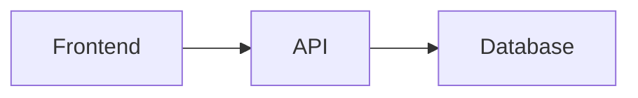

# Spec Patterns — Agent Reference

For the agent only. This is your architecture knowledge base for `4-spec`: which shapes to recommend, how to size a project against the learner and the POC boundary, how to simplify without losing the product, and how to explain any of it to someone who doesn't have the vocabulary yet.

## Common Small-Project Architectures

Drawn from analyzing hackathon winners (TreeHacks, World's Largest Hackathon, DeveloperWeek). Recommend whichever fits the product and what the learner has actually demonstrated — never a menu of all of them.

### React/Vite + BaaS (the most common winner pattern)
- **When:** Web app with dynamic data, accounts, or real-time features.
- **Shape:** React + Vite + Tailwind → Supabase or Firebase (database, auth, storage) → Netlify or Vercel.
- **Real example:** KeyHaven (World's Largest Hackathon winner) — React/TypeScript/Vite + Supabase + Stripe + Netlify.
- **Why it works:** The BaaS is the entire backend, so the learner writes none and can focus on the product instead of plumbing.
- **Tradeoffs:** Needs some existing React familiarity. BaaS configuration can become a larger source of friction than the code.

### Python + Streamlit (fastest to something demoable)
- **When:** Data-focused app, AI/ML project, internal tool, quick proof of concept.
- **Shape:** Python script → Streamlit for an instant web UI → external APIs.
- **Real example:** A serial winner (7 of 15 hackathons entered) uses Python + Streamlit + LangChain/LlamaIndex as a default stack.
- **Why it works:** Turns any Python script into a web app with zero frontend knowledge. Free hosting on Streamlit Community Cloud.
- **Tradeoffs:** Limited UI control, so a strong visual identity from `scope.md > Inspiration & Identity` may not survive. Great when the learner has written Python before, even just with an AI's help.

### Next.js full-stack
- **When:** Needs server rendering, API routes, and a polished frontend in one framework.
- **Shape:** Next.js App Router → route handlers or server actions → Prisma + SQLite/Postgres.
- **Why it works:** One framework, one deploy, no separate backend setup.
- **Tradeoffs:** The most framework-specific option here, with real conceptual overhead (server vs. client boundaries). Only recommend to someone who has used it or explicitly wants to learn it.

### Static site / client-only
- **When:** No backend needed — data is local, or comes straight from an external API.
- **Shape:** HTML/CSS/JS, or React with no server → `localStorage` or an external API.
- **Good for:** Tools, visualizations, single-user apps, browser extensions.
- **Tradeoffs:** Simplest possible deploy (GitHub Pages, Vercel drop-in). Nothing is shared between people or devices, which is fine far more often than learners expect.

### CLI tool
- **When:** No interface needed beyond a terminal.
- **Shape:** Python/Node/Go script with argument parsing.
- **Good for:** Automation, file processing, developer tools.
- **Tradeoffs:** Fast to build, no deployment, trivial to demo by recording a terminal. Weak fit if the product's appeal is visual.

### Bot / integration
- **When:** The product lives inside a tool people already use (Slack, Discord, a browser extension).
- **Shape:** Small server or handler → the host platform's UI.
- **Good for:** Extending existing workflows.
- **Tradeoffs:** The interface is someone else's problem, which is a gift. But platform setup — app registration, tokens, permissions, tunnels for local testing — adds several failure points before any product exists.

### Which patterns suit which learners
- **Little or no demonstrated experience:** static/client-only, a CLI tool, or Python + Streamlit. All three have one runtime, one file to start in, and no configuration ceremony.
- **Some demonstrated experience with the relevant language:** React/Vite + BaaS is the sweet spot — real capability, minimal backend.
- **Substantial demonstrated experience:** any of these, and ask their preference directly; they can evaluate the tradeoffs and should get to.
- **Regardless of experience:** an unfamiliar framework adds setup and debugging that do not strengthen the demonstration. Novelty is a cost the learner pays, not a feature.

### What winners have in common
- **Strong concept beats technical complexity.** Winners solve real problems simply, not complex problems elaborately.
- **BaaS over custom backends.** Supabase, Firebase, and Streamlit Cloud dominate because they delete backend boilerplate entirely.
- **AI/LLM integration is near-universal** in recent winners — which also means an LLM call on the critical path is a very common failure mode. Plan the fallback.
- **Plan before building.** Serial winners map data, hosting, and interactions before writing code. This whole skill is that habit.

## The Complexity Budget

An informal read on whether this architecture is a coherent way for this learner to prove the idea — stretched but reachable, without avoidable cost or risk. **Not a rubric and not a score.** Weigh:

- **Demonstrated experience** — what they've actually built, and how much of it they did versus the AI.
- **Unfamiliar frameworks** — each one adds setup and debugging in a system whose error messages may mean nothing to them yet.
- **Number of separate services** — every additional service adds an account, a key, and a failure mode.
- **Authentication or payments** — both add substantial complexity and rarely prove the product idea.
- **Real-time or background behavior** — sync, websockets, cron, queues. Hard to build, harder to debug.
- **Deployment difficulty** — free and instant, or a multi-step configuration?
- **Paid, unreliable, or restricted dependencies** — cost, rate limits, waitlists, approval flows.

**Over budget looks like:** three or more services to wire up; a login screen before any feature exists; a framework nobody in the conversation has used; a data model with six tables; a dependency needing a paid plan or manual approval; a demo that only works after a deploy; or "and then it syncs live between users."

When the architecture overwhelms the POC, simplify its expression rather than hand-waving the complexity.

## The Simplification Playbook

Preserve the central idea; swap the technical expression. Record every swap in the spec with its reason.

| Over budget | Simpler substitution that keeps the idea |
|---|---|
| Real accounts, passwords, sessions | A display name typed on first use, kept in local storage. Multi-person feel, no auth. |
| Multi-user real-time sync | One shared data file plus a refresh button, or a single-user version with sample data from "other people." |
| Hosted database with configured access rules | A local SQLite or JSON file. Same shape of data, same queries, no infrastructure. |
| Paid or rate-limited API on the critical path | A smaller free model, a cheaper endpoint, or seeded realistic sample data with the live call behind a flag. |
| Background jobs, cron, scheduled work | Do the work when the user opens the app or presses the button. Same output, visible timing. |
| File or image upload with cloud storage | Paste text, provide a URL, or read from a local folder. |
| Payments | A fake checkout screen that records the intent. The product idea is almost never the payment. |
| Deployment to a live URL | Run locally and record it — unless the learner said sharing a link matters, in which case pick the stack with the one-click deploy. |
| Email, SMS, or push notifications | Show it on screen, or write it to a file the learner can open. |
| Search over a large corpus | Search over a small curated set. Relevance is demonstrable at any scale. |

If a swap would kill `scope.md > The Unique Kernel`, it's the wrong swap. Find a different one, or cut a different feature.

## Explaining Architecture Without the Vocabulary

- **Walk one concrete journey through the system.** Describing components abstractly ("the frontend calls the API which queries the database") teaches nothing. Walking their actual behavior through it does: "You type the entry and hit save. That text goes into a file on your laptop called `entries.json`. When you open the app tomorrow, it reads that file back and shows you the list." Same architecture, and now they can repeat it.
- **Analogies that hold up:** a database is a spreadsheet the program reads and writes; an API is a form you submit to someone else's building and get a reply from; a server is a computer that's always on, waiting to be asked; `localStorage` is a sticky note the browser keeps for one site; a framework is a pile of decisions already made for you.
- **Name a thing, then use the name.** Introduce the term once with its plain meaning, then use it. Withholding vocabulary entirely leaves them unable to talk about their own app.
- **The failure mode is pseudo-explaining** — a fluent paragraph of jargon that sounds like an explanation and transfers nothing. Worse than silence, because it looks complete. If they couldn't say it back, you haven't explained it.
- **Check by asking them to say it back**, casually and once: "if a friend asked how this works, what would you tell them?" Their answer shows you exactly which piece didn't land.

## Diagramming

A conversation tool, not a deliverable. **ASCII** works everywhere:

```
┌──────────┐     ┌──────────┐     ┌──────────┐
│ Frontend │────→│   API    │────→│ Database │
└──────────┘     └──────────┘     └──────────┘
```

**Mermaid** renders more richly in many tools:



Pick whichever is clearest for the specific diagram. Don't make the learner choose a format.

## File Structure Conventions

Always include a full annotated tree in the spec. `5-build` and `5-build` both lean on it.

```
project/
├── src/
│   ├── components/    # UI components
│   ├── pages/         # Route-level pages
│   ├── lib/           # Shared utilities
│   └── api/           # API routes or client
├── devpost/           # Devpost learning workspace
├── package.json
└── README.md
```

The learner should be able to read the tree and know where everything lives.

## Data Flow Documentation

For any app that holds data, document how it moves:
1. Where does it originate? (User input, external API, file.)
2. Where is it stored?
3. How does it get from A to B?
4. What transforms along the way?

Keep it pragmatic — a short narrative or one diagram. No formal DFDs.

### State: where data lives

The single biggest source of confusion during a build. For every piece of data the app touches, the answer must exist in the spec: *where is this stored, how does it get updated, and what happens when the user navigates away and comes back?* **Do not use the phrase "state management"** with a learner who wouldn't recognize it — just ask the three questions in plain language.

## API and Service Contracts

For every external service, spell out the exact calls: endpoint, payload, response shape, auth method. Include doc links. This is the difference between a build that flows and a build that stalls while the agent reverse-engineers an API.

Where research is available, verify current versions, pricing, rate limits, and whether the library is still maintained, and share the links with the learner — modeling that habit is part of the lesson. Where it isn't, reason from what you know, **state your uncertainty explicitly**, and list the specific things to verify early in the build. Never imply a lookup happened when it didn't. A useful spec must be reachable with no network access.

## Error Boundaries and Fallbacks

Not exhaustive error handling. The two or three places this will actually break in front of someone: the API is slow, the data is empty, the input is strange. Pick a simple response for each — a loading state, a plain message, seeded sample data — and write it down.

## How Another Person Tries It

This is the durable version of "demo readiness," and it drives real architecture decisions.
- **Local only:** simplest, and the right default. Runs on localhost; a recording carries it to anyone else.
- **Deployed URL:** note the target (Vercel, Netlify, GitHub Pages, Railway, Fly.io) and put the deploy steps in the spec. Choose stacks that deploy in one step.
- **Recording:** zero infrastructure, and it always works.

Don't over-invest here. Deployment only earns its complexity if the learner specifically wants a link to share. If they do, that is a real constraint and should shape the stack choice, not be bolted on at the end.

## Section Depth and Traceability

`5-build` must be able to point at a specific part of the spec, which means anything it will reference needs its own heading. That is the whole requirement — **depth follows the product's actual complexity, not a ceremony quota.** A single-file CLI tool may need two levels; a full-stack app with several surfaces may need four. A wall of empty headings is worse than a flat document.

Reference PRD headings by name to keep traceability, using whatever headings that PRD actually has: "Implements `prd.md > Finding recipes`" or "See `prd.md > States and Boundaries` for the empty-state behavior." During the build, the agent can then look up both what to build and what it should do.

## Spec Self-Review

After drafting, review your own work for:
- Ambiguities that would confuse the build ("what exactly does 'handle auth' mean here?").
- PRD requirements with no home in the architecture.
- Complexity that does not help prove the POC ("six tables for a simple single-user tool").
- Internal inconsistency between the data model, the file tree, and the components.
- Failure points with no fallback.

If the harness supports an independent review pass, use one; otherwise do it directly. Either way, surface the two or three most important findings to the learner as genuine questions rather than a report.
